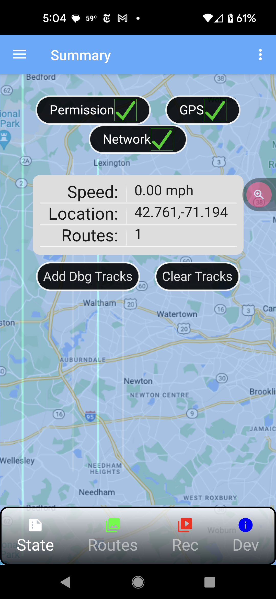
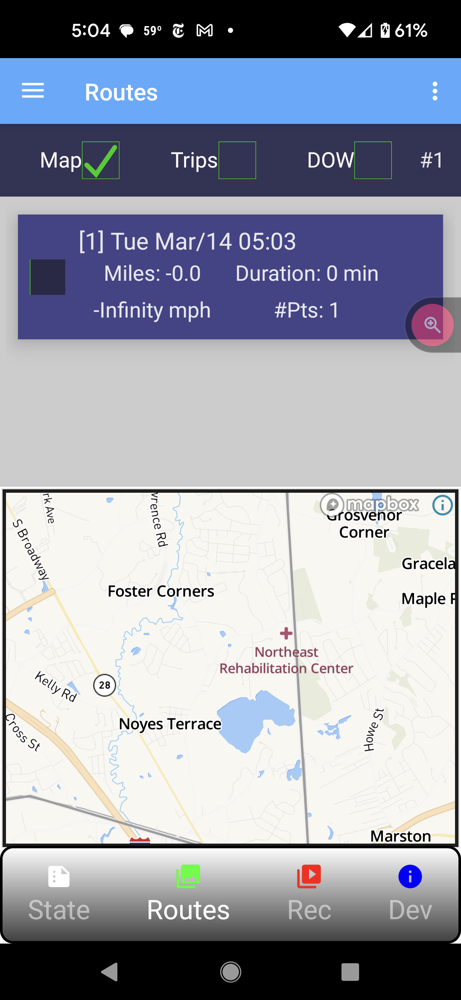
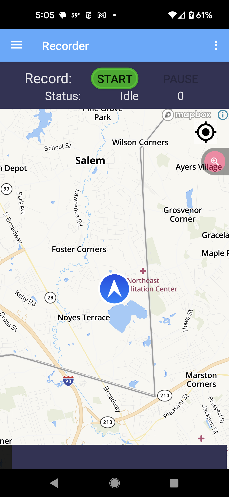
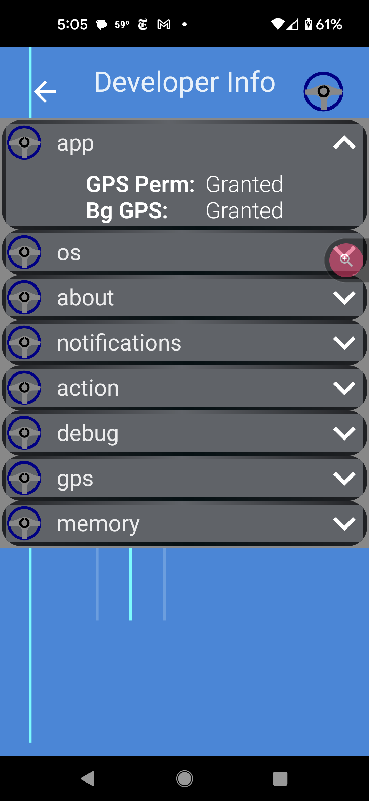

# max-auto-route
Automotive Route Recorder Android App

Demo app to experiment with recording and comparing routes to automatically
determine current route by matching location, time and day-of-week to previously 
recorded tracks/trips. 

## Terms

- Track = GPS path driven (car start/stop)
- Trip = collection of tracks with similar end points. 
Commute to work and commute home are part of same trip. 

## Screens

### Summary Page

---

### Routes Page - List and manipulate reecorded tracks/routes/trips

---

### Record Page - record current GPS actitivity to create a track.

---

### Developer Page - app/sys internals. 

---
