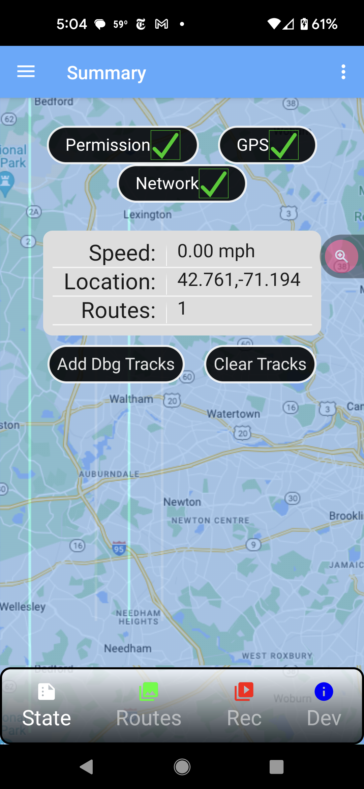
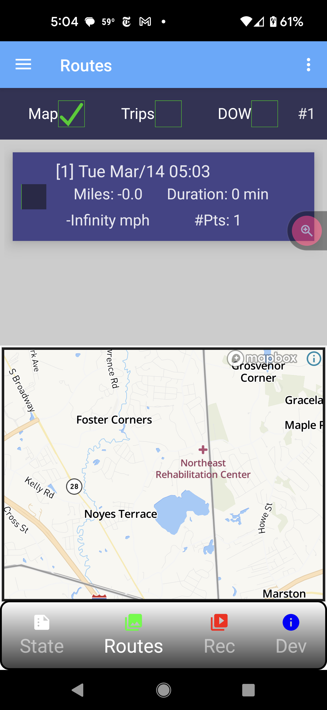
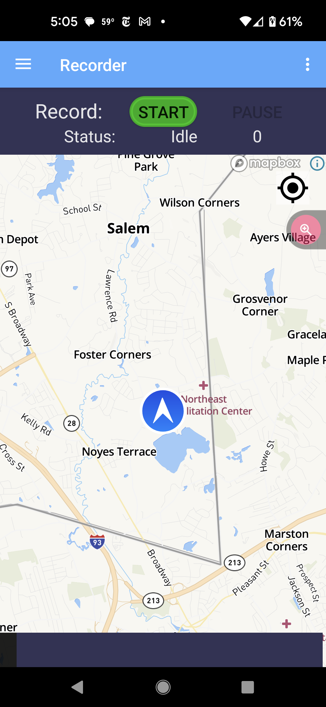
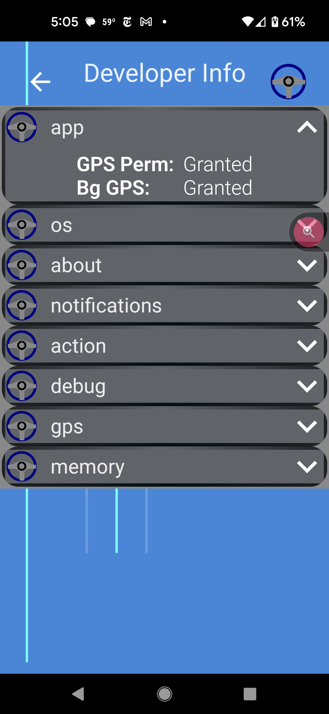

# all-route (EXPERIMENT - NOT DONE YET)
<br>18-Arp-2026
<br>API 36 AndroidX Java
<br>[Home website](https://landenlabs.com/android/index.html)


Android Route Recorder App

Demo app to experiment with recording and comparing routes to automatically
determine current route by matching location, time and day-of-week to previously 
recorded tracks/trips. 

## Terms

- Track = GPS path driven (car start/stop)
- Trip = collection of tracks with similar end points. 
Commute to work and commute home are part of same trip. 

## Build Setup

The map layer runs on **mapsdk-v2** (TWC's Kotlin wrapper around **Pangea 5.11**), replacing
the old WSI MapSDK v1 / Pangea 4.20 stack. See [dev-notes.md](dev-notes.md) for the full
migration write-up, dependency graph, and map init flow.

To build/run, you need:

- **JDK 21+** available to Gradle (the toolchain in the root `build.gradle` requests 21 even
  though the app still targets Java 17 bytecode - Pangea 5's artifacts ship class files `javac`
  older than 21 can't read).
- A `local.properties` in the repo root with:
  ```properties
  mapSDKKey="<your mapsdk-v2 API key>"
  sunApiKey=""
  sunProductSet=""
  ```
  (`route/build.gradle` reads these into `BuildConfig`/`resValue`s consumed by `MapViewer.initBeforeCreate()`.)
- `libs/mapsdkv2-<version>.aar` present - built from the sibling project
  `mapsdk-v2` (module `map-sdk`) and copied in manually; it isn't published to a resolvable repo.
- `minSdk` is **29** (bumped from 28) - required by the mapsdkv2 AAR's manifest.


## Screens

### Summary Page



---


### Routes Page - List and manipulate reecorded tracks/routes/trips


---


### Record Page - record current GPS actitivity to create a track.


---


### Developer Page - app/sys internals. 


---
